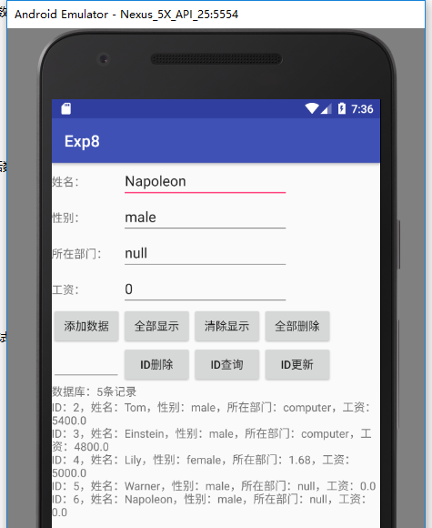

# 实验8： SQLite数据库

分别使用sqlite3工具和Android代码的方式建立SQLite数据库，数据库名称为test.db，并建立staff数据表，表内的属性值如下表所示：

|属性|数据类型|说明|
|-|-|-|
|_id|integer|主键|
|name|text|姓名|
|sex|text|性别|
|department|text|所在部门|
|salary|float|工资|

在完成建立数据库的工作后，编程实现基本的数据库操作功能，包括数据的添加、删除和更新，并尝试将下表中的数据添加到staff表中。

|_id|name|sex|department|salary|
|-|-|-|-|-|
|1|Tom|male|computer|5400|
|2|Einstein|male|computer|4800|
|3|Lily|female|1.68|5000|
|4|Warner|male| null|null |
|5|Napoleon|male| null| null|

最后，建立一个ContentProvider，用来共享新建的数据库，并尝试使用ContentResolver在其它进程中对数据库进行操作。

## 使用sqlite3工具建立SQLite数据库

## 使用Android代码建立SQLite数据库

## 将表中的数据添加到staff表中

## 建立一个ContentProvider，用来共享新建的数据库，并尝试使用ContentResolver在其它进程中对数据库进行操作

